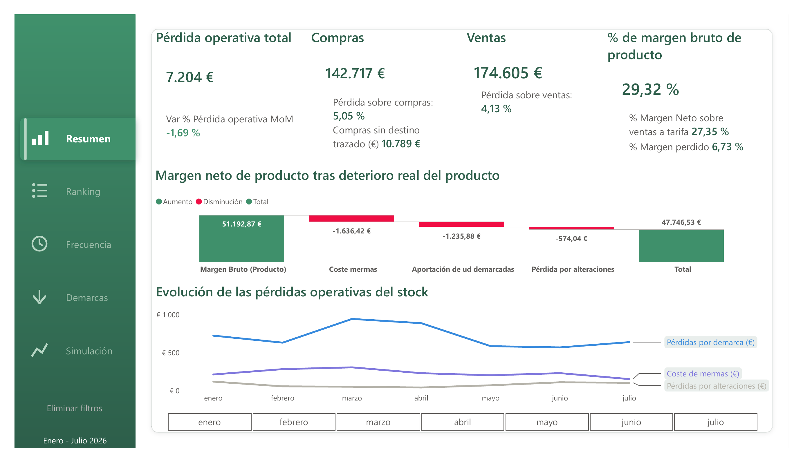
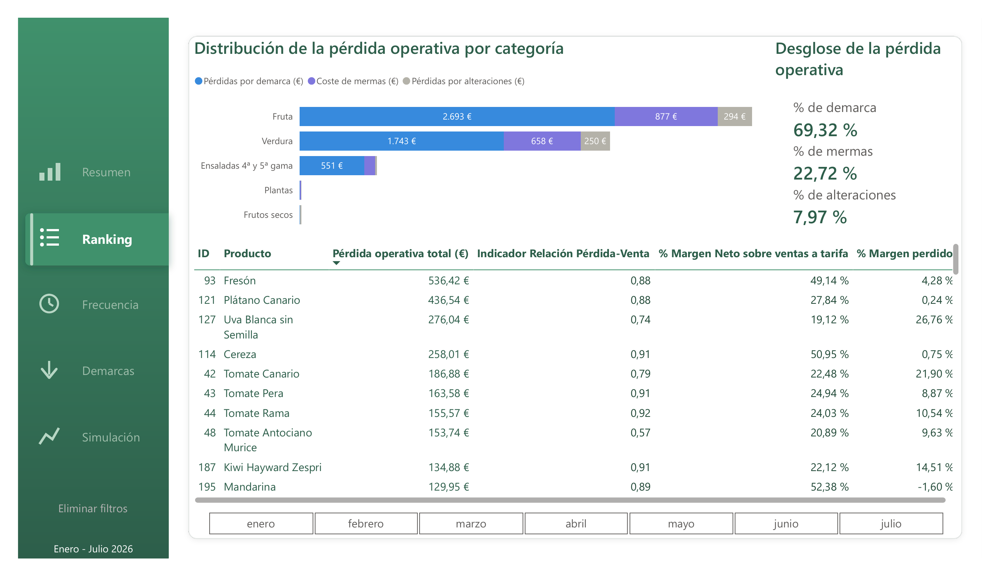
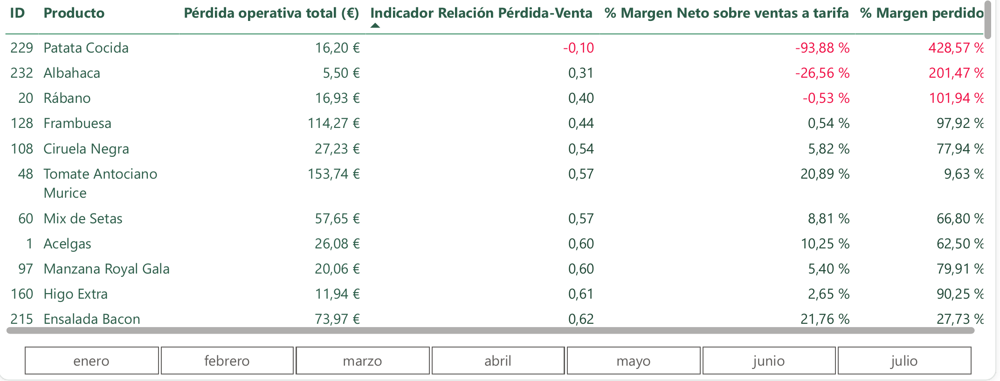
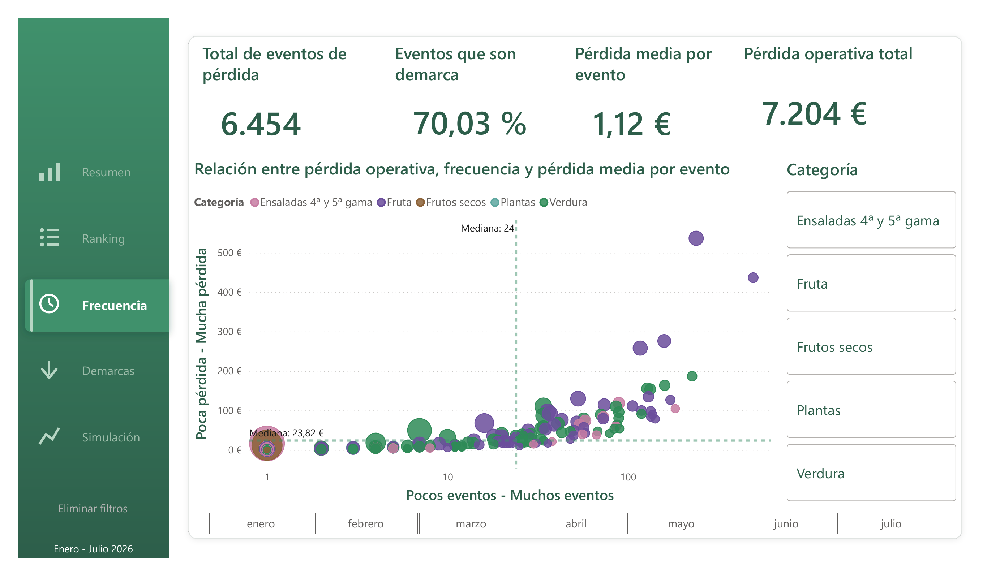
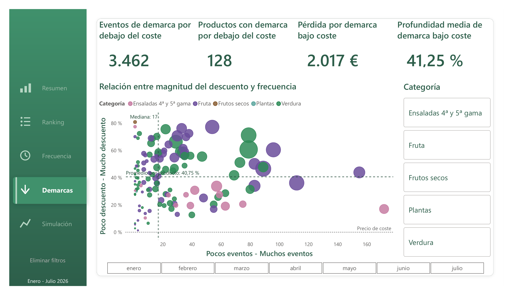
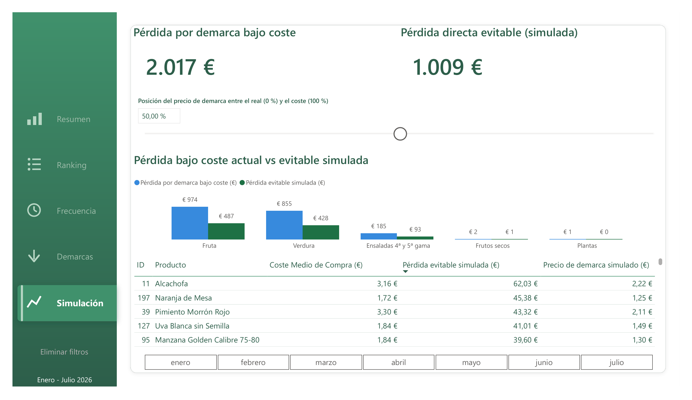

# Análisis completo - Pérdidas operativas del stock

Parte 1 de 2 de la documentación ampliada del proyecto. Cubre el problema de negocio, la estructura del dashboard página a página, la simulación de recuperación y las conclusiones y recomendaciones derivadas del análisis. Para el pipeline técnico, el modelo de datos y las medidas DAX, ver [Parte 2: Arquitectura técnica](02-arquitectura-tecnica.md)

Periodo analizado: enero–julio 2026 (7 meses, más de 64.000 registros) en una frutería con inventario perecedero, sobre tres tipos de deterioro de stock: mermas, demarcas y alteraciones.

**7.204 € de pérdida operativa en el periodo (4,13 % de las ventas), de los que 2.017 € corresponden a pérdida directa evitable mediante un suelo de precio en demarca.**

---
# Índice de contenidos

### Parte 1: El negocio

- [El problema de negocio](#el-problema-de-negocio)
- [Estructura del dashboard](#estructura-del-dashboard)
- [Simulación de recuperación: acción e impacto](#simulación-de-recuperación-acción-e-impacto)
- [Hallazgos y recomendaciones](#hallazgos-y-recomendaciones)

---
## El problema de negocio

El proyecto se centra en una frutería que gestiona a diario un stock altamente perecedero. Parte de ese stock se pierde o se vende por debajo de su valor esperado por varias vías: producto que caduca o se estropea antes de venderse (mermas), producto que se rebaja de precio para adelantarse a ese deterioro (demarcas), y ajustes de inventario por roturas, errores de conteo o incidencias (alteraciones). El proyecto llama a la suma de estos tres efectos **deterioro económico del stock**.

**El objetivo del análisis** es cuantificar ese deterioro y ayudar a decidir dónde actuar primero.

Preguntas de negocio que responde el proyecto:

- ¿Cuánto dinero se pierde por deterioro del stock, en total y como porcentaje de compras-ventas y como afecta al margen de producto?
- ¿Qué productos y categorías concentran la mayor parte de la pérdida, y a qué tipo de pérdida corresponde? y ¿Qué productos tienen una relación pérdida-venta próxima a 0, y cuánto compromete esto su margen neto?
- ¿Las pérdidas son puntuales o recurrentes? ¿Qué categorías combinan alta frecuencia con alta pérdida?
- ¿Qué parte de las demarcas corresponden a ventas por debajo del propio coste de compra, el caso más grave?
- Si se actuara sobre esas ventas por debajo de coste, ¿cuánta pérdida directa sería evitable y bajo qué condición?

---

## Estructura del dashboard

El informe tiene 5 páginas, con una narrativa de cuánto → qué → con qué frecuencia → qué tan grave → cómo actuar
### Página 1: Resumen

**Pregunta:** ¿Cuánto se pierde por deterioro de stock, en términos absolutos y relativos a compras-ventas y cómo afecta al margen del producto?
**Respuesta:** 7.204 € de pérdida operativa en el periodo, en términos absolutos: 4,13 % de las ventas y 5,05 % de las compras del periodo (142.717,46 €). Supone el 6,73 % del margen bruto del producto (de 29,32 € de margen bruto por cada 100 € vendidos, quedan 27,35 € de margen neto).

- KPIs de cabecera (`Pérdida operativa total (€)`, `Compras (€)`, `Ventas (€)`, `% Margen bruto del producto`) y un gráfico de cascada que descompone `Margen Bruto del producto (€)` hasta `Margen Neto del producto`, restando `Coste de mermas (€)`, `Aportación de unidades demarcadas (€)` y `Pérdidas por alteraciones (€)`.
- En los KPIs de cabecera también se muestra como referencia: `Var % Pérdida operativa MoM`, `Compras sin destino trazado (€)`, `% pérdidas s/Compras`, `% pérdidas s/ventas`, `% Margen Neto sobre ventas a tarifa` y `% Margen perdido`.
- El gráfico de líneas muestra la evolución de los tres tipos de pérdidas a lo largo de los 7 meses.
- Segmentación por mes en el periodo enero-julio 2026.

>**Nota conceptual.** `Pérdida operativa total (€)` combina dos naturalezas económicas distintas: mermas (1.636,42 €) y alteraciones (574,04 €) son salidas de caja, producto que se destruye o se ajusta y deja de tener valor; demarcas (4.993,66 €) es margen no percibido sobre unidades que sí se llegaron a vender, no dinero perdido en sentido estricto. La cifra conjunta de 7.204 € es útil como KPI único de seguimiento, pero al presentarla conviene aclarar que el 69,32 % de ese importe es coste de oportunidad, no efectivo desembolsado.

> **Nota sobre la cascada.** El gráfico de cascada no resta `Pérdidas por demarca (€)` (4.993,66 €, la cifra de la nota anterior), sino `Aportación de unidades demarcadas (€)` (−1.235,88 €): el resultado real de esas mismas ventas en demarca, ingreso menos coste, sin compararlo contra el precio de lista. Son dos lecturas legítimas y compatibles de la misma actividad, no dos cálculos contradictorios: la primera cuantifica el margen no percibido frente al precio original (útil para seguimiento), la segunda cuantifica si esas ventas dejaron beneficio real (lo que efectivamente reduce el margen neto del producto). Al leer la cascada, el paso "Aportación de ud demarcadas" no debe interpretarse como una repetición de los 4.993,66 € citados arriba.

>**Nota de trazabilidad.** 10.789,05 € de las compras del periodo (7,56 % del importe comprado, 8,01 % de las unidades) no tienen salida trazada en ventas, demarcas, mermas ni alteraciones dentro de la ventana temporal. Las unidades demarcadas se cuentan como salida porque no figuran en `ventas_linea` (ver limitación 2). Al incluirlas, 66 productos muestran más salidas que compras, lo que indica que el generador sintético no cuadra el stock por producto: la diferencia restante puede corresponder a stock inicial, stock de cierre o artefactos del generador, y no se puede separar sin inventarios de apertura y cierre. Esta cifra mide ausencia de trazabilidad, no deterioro confirmado, y no debe sumarse a los 7.204 € de pérdida operativa.

### Página 2: Ranking

**Pregunta 1:** ¿Qué productos y categorías concentran la mayor parte de la pérdida, y a qué tipo de pérdida corresponde?
**Respuesta 1:** Fruta es la categoría que más pérdida operativa concentra (2.693 € en demarcas, 877 € en mermas y 294 € en alteraciones), y dentro de ella, Fresón (536,42 €), Plátano Canario (436,54 €) y Uva Blanca sin Semilla (276,04 €) son los productos con mayor pérdida absoluta, en los tres casos, mayoritariamente por demarca.

- Gráfico de barras apiladas con desglose de las pérdidas operativas del stock por categoría (fruta, verdura, ensaladas 4ª y 5ª gama, plantas, frutos secos)
- Tres KPI de desglose por tipo de pérdida en porcentaje (`% de mermas`, `% de demarca`, `% de alteraciones`) son dinámicos al seleccionar una categoría, por ejemplo Fruta, los tres KPI se recalculan mostrando el peso de cada tipo de pérdida específico de esa categoría. 
- Tabla de productos ordenada por `Pérdida operativa total (€)`, con `Indicador Relación Pérdida-Venta` y `% Margen perdido` como columnas de contexto. 
- Segmentación por mes en el periodo enero-julio 2026.

> **Nota:** Encurtidos (5 referencias, 448,11 € de venta) es la única categoría del catálogo con deterioro cero en los 7 meses. No es un hueco del análisis: es producto no perecedero en un catálogo dominado por fresco, y sirve como línea base de contraste frente al 4,13 % de pérdida sobre ventas del resto.

**Pregunta 2:** ¿Qué productos tienen una relación pérdida-venta próxima a 0, y cuánto compromete esto su margen neto?
**Respuesta 2:** Patata Cocida (`Indicador Relación Pérdida-Venta` de −0,1, margen neto ya negativo), Albahaca (0,31), Rábano (0,4) y Frambuesa (0,44) son los casos más graves; ninguno aparece entre los diez primeros por pérdida absoluta.

- Misma tabla de productos, reconfigurada: ordenada por proximidad a 0 en dicho indicador, en lugar de por pérdida operativa absoluta. Este orden prioriza el desequilibrio relativo entre lo que un producto vende y lo que pierde, no el volumen de euros en juego: un producto de bajo volumen puede pasar desapercibido en la vista ordenada por pérdida absoluta y, sin embargo, ser el que más necesita revisión de precio de venta, frecuencia de compra o gestión de rotación.

Su gravedad no está en el volumen, sino en que el deterioro ya ha anulado por completo el margen que generaron.

### Página 3: Frecuencia

**Pregunta:** ¿Las pérdidas son puntuales o recurrentes? ¿Qué categorías combinan alta frecuencia con alta pérdida?
**Respuesta:** Las pérdidas son mayoritariamente recurrentes, no puntuales: `Pérdida media por evento (€)` es de solo 1,12 €, sin incidentes aislados de gran magnitud. El 85,4 % de los productos (129 de 151) cae en la diagonal esperada entre frecuencia e importe; solo 22 productos (14,6 %) la rompen y merecen revisión individual.

- KPIs de cabecera: `Nº Eventos de pérdida`, `% Eventos de demarca sobre el total`, `Pérdida media por evento (€)` y `Pérdida operativa total (€)`.
- Scatter de productos según `Nº Eventos de pérdida` (eje X) y `Pérdida operativa total (€)` (eje Y), con el tamaño de burbuja representando `Pérdida media por evento (€)` y la categoría como leyenda de color. 
- Segmentación por categoría y mes en el periodo enero-julio 2026.

La magnitud relevante del gráfico no es la posición respecto a las medianas de cada eje por separado (estas solo muestran una referencia global), sino la proximidad de la masa de productos a cada una de las cuatro esquinas del espacio:

| Esquina                                           | Significado                                | Patrón observado (151 productos; medianas: 24 eventos, 23,82 €) |
| ------------------------------------------------- | ------------------------------------------ | --------------------------------------------------------------- |
| Inferior izquierda (pocos eventos, poca pérdida)  | Productos sin problema relevante           | 65 productos (43,0 %)                                           |
| Inferior derecha (muchos eventos, poca pérdida)   | Goteo frecuente de bajo impacto individual | 11 productos (7,3 %)                                            |
| Superior izquierda (pocos eventos, mucha pérdida) | Incidentes puntuales de gran magnitud      | 11 productos (7,3 %)                                            |
| Superior derecha (muchos eventos, mucha pérdida)  | Frecuencia y volumen altos a la vez        | 64 productos (42,4 %)                                           |

El 85,4 % de los productos (129 de 151) cae en la diagonal inferior-izquierda o superior-derecha. Solo 22 productos (14,6 %) son anómalos en un eje sin serlo en el otro, y son los que merecen mirada individual.

La lectura de negocio no es "casi todo el catálogo está limpio", sino que el deterioro es un fenómeno de goteo estructural, no de incidentes: `Pérdida media por evento (€)` es de 1,12 € y ningún producto rompe esa proporcionalidad de forma significativa. El eje X es logarítmico, lo que comprime visualmente la cola derecha.

> **Nota sobre mediana vs. promedio**: el scatter usa mediana en lugar de media para los ejes de referencia, porque unos pocos eventos de pérdida puntualmente muy alto distorsionan el promedio y dan una imagen poco representativa del comportamiento típico del producto.

### Página 4: Demarcas

**Pregunta:** de todas las pérdidas por demarca, ¿Cuánto corresponde específicamente a vender por debajo del coste de compra, el caso más grave?
**Respuesta:** [2.017,33 €](../SQL/auditoria.md#14-peso-de-las-demarcas-bajo-coste-201733--sobre-coste) de `Pérdida por demarca bajo coste (€)` en [128 productos](../SQL/auditoria.md#13-el-97-de-132-productos-con-coste-conocido-y-demarca-tienen-demarca-bajo-coste), con un 41,25 % de `Profundidad media de demarca bajo coste (%)`. Solo 33 productos (25,8 %) combinan alta frecuencia y alta profundidad a la vez.

Foco exclusivo en demarcas, que concentran el 69,32 % de `Pérdida operativa total (€)`. 
- KPIs de cabecera: `Nº Eventos de demarca bajo coste`, `Nº Productos con demarca bajo coste`, `Pérdida por demarca bajo coste (€)` y `Profundidad media de demarca bajo coste (%)`.
- Segmentación por categoría y mes en el periodo enero-julio 2026.

El scatter relaciona `Nº Eventos de demarca bajo coste` (eje X) con `Profundidad media de demarca bajo coste (%)` (eje Y), con el tamaño de burbuja representando `Pérdida por demarca bajo coste (€)` asociada. El propio gráfico ya está filtrado a demarcas por debajo de coste, por lo que ningún punto aparece por debajo de 0% en el eje Y (esta línea constante en 0% se añade solo como referencia informativa del suelo de coste, sin dividir el gráfico, conforme subimos por el eje Y más se aleja el precio de demarca del precio de coste). Una línea de mediana (eje X: 17 eventos; y línea de promedio en eje Y: 40,75 % profundidad media por producto) marcan la referencia global de cada eje, y la magnitud relevante, igual que en la página 3, es la proximidad de la masa de productos a cada una de las cuatro esquinas del espacio:

| Esquina                                               | Significado                                       | Patrón observado (128 productos; mediana 17 eventos, promedio 40,75 %) |
| ----------------------------------------------------- | ------------------------------------------------- | ---------------------------------------------------------------------- |
| Inferior izquierda (pocos eventos, poca profundidad)  | Demarcas bajo coste ocasionales y leves           | 36 productos (28,1 %)                                                  |
| Inferior derecha (muchos eventos, poca profundidad)   | Demarcas bajo coste recurrentes de descuento leve | 30 productos (23,4 %)                                                  |
| Superior izquierda (pocos eventos, mucha profundidad) | Descuento severo concentrado en pocos eventos     | 29 productos (22,7 %)                                                  |
| Superior derecha (muchos eventos, mucha profundidad)  | El caso más grave: frecuente y profundo a la vez  | 33 productos (25,8 %)                                                  |

Los cuatro cuadrantes están poblados de forma casi uniforme (entre el 22,7 % y el 28,1 %). Que un producto se demarque bajo coste a menudo no dice nada sobre cuánto se rebaja
cuando lo hace.

Ese es el hallazgo accionable: son dos palancas separadas. Reducir la frecuencia (rotación, tamaño de pedido) y reducir la profundidad (suelo de precio, demarcar antes) atacan poblaciones de producto distintas, y los 33 productos del cuadrante superior derecho son los únicos que necesitan las dos a la vez.

Las burbujas crecen hacia la derecha porque el tamaño codifica la pérdida acumulada, que crece por construcción con el número de eventos. No debe leerse como que las demarcas recurrentes sean más caras por unidad.

> **Nota sobre mediana vs. promedio**: el scatter usa promedio en lugar de mediana en el eje Y por que va en sintonía al KPI `Profundidad media de demarca bajo coste (%)` (al contrario que en la página 3) y mediana en el eje X debido a la presencia de unos pocos eventos de gran volumen que distorsionarían el promedio. 
### Página 5: Simulación

**Pregunta:** si el precio de demarca de esas unidades se acercara al coste, ¿cuánta pérdida directa sería evitable manteniendo el volumen de venta?
**Respuesta:** Con el slider al 50 %, `Pérdida evitable simulada (€)` es de 1.009 € (mitad del techo teórico de 2.017,33 € al 100 %), asumiendo volumen de venta constante.

- KPIs de cabecera: `Pérdida por demarca bajo coste (€)` (importe de partida, heredado de la página 4) y `Pérdida evitable simulada (€)` (según la posición del slider)
- Un control deslizante (`Posición del precio de demarca entre el real (0 %) y el coste (100 %)`, 0 a 100% en pasos de 10) permite mover el escenario de recuperación. 
- Un gráfico de barras agrupadas compara, por categoría, `Pérdida por demarca bajo coste (€)` frente a `Pérdida evitable simulada (€)` en la posición actual del slider.
- Una tabla de productos desglosa, para cada uno `Coste Medio de Compra`, `Pérdida evitable simulada (€)` en euros y `Precio de demarca simulado (€)` resultante.
- Segmentación por mes en el periodo enero-julio 2026.

El desarrollo funcional completo de la mecánica del slider, las medidas DAX implicadas y un ejemplo verificado están en la siguiente sección.

---
## Simulación de recuperación: acción e impacto

La página de Simulación traslada el diagnóstico de la página 4 a un escenario de acción: **¿qué pasaría si las ventas por debajo de coste se hubieran hecho al coste?**

**Mecánica del slider**: El slider fija la posición del precio de demarca simulado en el recorrido entre el precio real (0 %) y el coste medio de compra (100 %). Con volumen constante, mover el precio un X % de ese recorrido evita exactamente el X % de la pérdida bajo coste de cada evento, por eso el porcentaje de precio y el porcentaje de pérdida evitada coinciden en el modelo; en la realidad solo coincidirían si la demanda no reaccionara al precio.

En el extremo del 0%, el precio de demarca simulado coincide con el precio real actual (sin cambios). En el extremo del 100%, el precio simulado iguala el coste medio de compra y el impacto por venta bajo coste se anula en el modelo.

**Medidas implicadas**:

- `Pérdida evitable máxima (€)`: techo teórico al 100 %, misma lógica que `Pérdida por demarca bajo coste (€)` de la página 4, expresada como pérdida directa evitable.
- `Valor de Parámetro Recuperación`: lee la posición del slider (`SELECTEDVALUE` sobre la tabla `Parámetro Recuperación`, por defecto 1).
- `Pérdida evitable simulada (€)`: aplica el porcentaje del slider al techo teórico.
- `Precio de demarca simulado (€)`: interpola linealmente, por producto, entre el precio de demarca real medio (slider en 0) y el coste medio de compra (slider en 1).

**Ejemplo verificado** (Alcachofa, slider a 50%): recuperación potencial de 62,03 €, precio de demarca simulado de aproximadamente 2,22 €, partiendo de un coste medio de compra de 3,16 €.

>**Supuesto y limitación**: el escenario asume volumen de venta constante. No modela que un precio de demarca más alto pueda reducir la demanda o aumentar el volumen que termina en merma en lugar de venderse. El 100% es, por tanto, un techo teórico de recuperación, no una previsión de resultado.

---
## Hallazgos y recomendaciones

| #     | Hallazgo                                                                                                                                                                                                      | Acción                                                                                                                                                                                           | Impacto                                                                                                                                                                                                           |
| ----- | ------------------------------------------------------------------------------------------------------------------------------------------------------------------------------------------------------------- | ------------------------------------------------------------------------------------------------------------------------------------------------------------------------------------------------ | ----------------------------------------------------------------------------------------------------------------------------------------------------------------------------------------------------------------- |
| **1** | Las demarcas dominan el deterioro, y dentro de ellas la venta por debajo de coste es el tramo más grave. Frecuencia y profundidad del descuento son palancas independientes.                                  | Fijar un suelo de precio en demarca (nunca por debajo del coste medio), aplicado primero a los productos con ventas bajo coste, priorizando los que combinan alta frecuencia y alta profundidad. | Elimina la mayor parte de la pérdida directa evitable; [no genera margen adicional, ya que esas unidades pasan a venderse justo al coste](02-arquitectura-tecnica.md#limitaciones-y-qué-debería-capturar-el-erp). |
| **2** | Fresón, Plátano Canario y Uva Blanca sin Semilla concentran la mayor pérdida absoluta, pero con una relación pérdida-venta saludable: pierden por volumen, no por mala gestión.                               | Priorizar seguimiento de rotación y frecuencia de reposición en estos 3 productos por su peso absoluto.                                                                                          | Una mejora porcentual pequeña en estos productos mueve más euros absolutos que la misma mejora en productos de menor volumen.                                                                                     |
| **3** | Patata Cocida, Albahaca, Rábano y Frambuesa tienen la relación pérdida-venta más baja del catálogo; los tres primeros ya operan con margen neto negativo.                                                     | Revisar viabilidad en catálogo (precio de compra, tamaño de pedido o continuidad), priorizando Patata Cocida y Albahaca.                                                                         | Evita seguir financiando ventas con pérdida directa.                                                                                                                                                              |
| **4** | [La mayoría de las demarcas bajo coste se vende a un precio simbólico](../SQL/auditoria.md#12-el-7813-de-demarcas-bajo-coste-se-vende-a-1-o-menos), señal de que el producto entra tarde al ciclo de demarca. | Revisar y adelantar el momento en que estos productos entran en demarca.                                                                                                                         | Reduce la profundidad media de descuento.                                                                                                                                                                         |
| **5** | Ensaladas 4ª y 5ª gama es la categoría donde mayor proporción de su deterioro proviene de demarcas.                                                                                                           | Auditar rotación y ciclo de vida de esta categoría en concreto.                                                                                                                                  | Mayor margen de mejora relativo a su tamaño.                                                                                                                                                                      |
| **6** | La mayoría del catálogo tiene una pérdida proporcional a su frecuencia de eventos (goteo estructural); solo un pequeño grupo de productos rompe esa proporcionalidad.                                         | Revisar individualmente esos productos anómalos; el resto se resuelve con las medidas generales de los hallazgos 1 y 3.                                                                          | Enfoca el esfuerzo de revisión manual en un subconjunto pequeño y accionable.                                                                                                                                     |

> **Nota:** estas recomendaciones no implican eliminar directamente ningún producto del catálogo. Antes de tomar esa decisión habría que comprobar su viabilidad real considerando otros factores no capturados en este modelo: exposición en tienda, calidad del producto, ventana media de venta y demás variables operativas que escapan al alcance de este análisis.